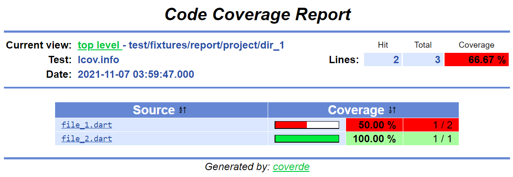

# Coverde

[![pub package][pub_badge]][pub_link]
[![License: MIT][license_badge]][license_link]
[![Dart CI][dart_ci_badge]][dart_ci_link]
[![codecov][codecov_badge]][codecov_link]
[![style: very good analysis][very_good_analysis_badge]][very_good_analysis_link]
[![melos][melos_badge]][melos_link]

A CLI for basic coverage trace files manipulation.

---

# Installing

```sh
$ dart pub global activate coverde
```

---

# Features

- [**Check coverage value computed from a trace file**](#coverde-check)
- [**Filter the tested files included in a trace file**](#coverde-filter)
- [**Remove a set of files and folders**](#coverde-remove)
- [**Generate HTML coverage report**](#coverde-report)
- [**Compute and display the coverage value from a trace file**](#coverde-value)

## `coverde check`

**Check coverage value computed from a trace file.**

### Parameters

|      Order       |                               Description                               | Required |
| :--------------: | :---------------------------------------------------------------------: | :------: |
| Unique parameter | An integer between 0 and 100 used as minimum acceptable coverage value. |    ✔     |

### Options

|     Option      |               Description               |    Default value     |
| :-------------: | :-------------------------------------: | :------------------: |
| `--input`, `-i` | Trace file used for the coverage check. | `coverage/lcov.info` |

### Flags

|                           Flag                           |      Description      | Default value |
| :------------------------------------------------------: | :-------------------: | :-----------: |
| Enable: `--verbose`, `-v`<br><br>Disable: `--no-verbose` | Print coverage value. |   _Enabled_   |

### Examples

- `coverde check 90`
- `coverde check 75 -i lcov.info`
- `coverde check 100 --no-verbose`

## `coverde filter`

**Filter the tested files included in a trace file.**

### Options

|      Option       |                                                          Description                                                          |         Default value         |
| :---------------: | :---------------------------------------------------------------------------------------------------------------------------: | :---------------------------: |
|  `--input`, `-i`  |                                              Coverage trace file to be filtered.                                              |     `coverage/lcov.info`      |
| `--output`, `-o`  |                             Filtered coverage trace file (automatically created if it is absent).                             | `coverage/filtered.lcov.info` |
| `--filters`, `-f` |                           Set of comma-separated patterns of the files to be opted out of coverage.                           |                               |
|  `--mode`, `-m`   | The mode in which the filtered trace file content should be generated.<br><br>`a`: append content.<br>`w`: overwrite content. |     `a` (append content)      |

### Examples

- `coverde filter`
- `coverde filter -f \.g\.dart`
- `coverde filter -f \.freezed\.dart -mode w`
- `coverde filter -o coverage/tracefile.info`

## `coverde remove`

**Remove a set of files and folders.**

### Flags

|                               Flag                               |                                                                            Description                                                                             | Default value |
| :--------------------------------------------------------------: | :----------------------------------------------------------------------------------------------------------------------------------------------------------------: | :-----------: |
| Enable: `--accept-absence`<br><br>Disable: `--no-accept-absence` | Set the command behavior according to a file/folder existence. If enabled, the command continues and notifies the element absence. If disabled, the command fails. |   _Enabled_   |

### Examples

- `coverde remove file.txt`
- `coverde remove path/to/folder/`
- `coverde remove path/to/another.file.txt path/to/another/folder/ local.folder/`

## `coverde report`

**Generate HTML coverage report.**

### Options

|       Option       | Description                                                         |    Default value     |
| :----------------: | ------------------------------------------------------------------- | :------------------: |
| `--input`<br>`-i`  | Coverage trace file to be used as source for report generation.     | `coverage/lcov.info` |
| `--output`<br>`-o` | Destination folder where the generated report files will be placed. |   `coverage/html/`   |
|     `--medium`     | Medium threshold for coverage value.                                |          75          |
|      `--high`      | High threshold for coverage value.                                  |          90          |

The report style is dynamically set according to individual, group and global coverage and the `--medium` and `--high` options.

### Examples

- `coverde report`
- `coverde report -i coverage/tracefile.info --medium 50`
- `coverde report -o coverage/report --high 95`

### Results




## `coverde value`

**Compute and display the coverage value from a trace file.**

### Options

|     Option      |                          Description                           |    Default value     |
| :-------------: | :------------------------------------------------------------: | :------------------: |
| `--input`, `-i` | Coverage trace file to be used for coverage value computation. | `coverage/lcov.info` |

### Flags

|                           Flag                           |                              Description                              | Default value |
| :------------------------------------------------------: | :-------------------------------------------------------------------: | :-----------: |
| Enable: `--verbose`, `-v`<br><br>Disable: `--no-verbose` | Print coverage value for each source file included by the trace file. |   _Enabled_   |

### Examples

- `coverde value`
- `coverde value -i coverage/tracefile.info --no-verbose`

[codecov_badge]: https://codecov.io/gh/mrverdant13/coverde/branch/main/graph/badge.svg
[codecov_link]: https://codecov.io/gh/mrverdant13/coverde
[dart_ci_badge]: https://github.com/mrverdant13/coverde/workflows/Dart%20CI/badge.svg
[dart_ci_link]: https://github.com/mrverdant13/coverde/actions?query=workflow%3A%22Dart+CI%22
[license_badge]: https://img.shields.io/badge/license-MIT-blue.svg
[license_link]: https://opensource.org/licenses/MIT
[melos_badge]: https://img.shields.io/badge/maintained%20with-melos-f700ff.svg
[melos_link]: https://github.com/invertase/melos
[pub_badge]: https://img.shields.io/pub/v/coverde.svg
[pub_link]: https://pub.dev/packages/coverde
[very_good_analysis_badge]: https://img.shields.io/badge/style-very_good_analysis-B22C89.svg
[very_good_analysis_link]: https://pub.dev/packages/very_good_analysis
